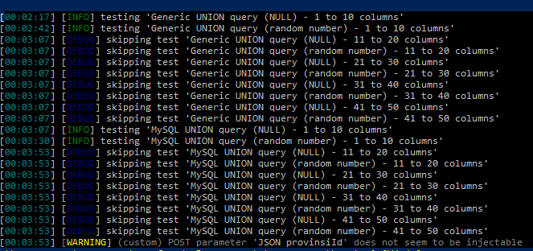

# Laporan Pengujian SQL Injection Endpoint Area Kota

## Informasi Endpoint
- **Endpoint**: `/type-r-v2/api/Area/Kota`
- **Method**: POST
- **Body/JSON Original**:
    ```json
    {
        "provinsiId": 0
    }
    ```

## Ringkasan Pengujian
Pengujian ini dilakukan untuk mendeteksi adanya kerentanan SQL Injection pada endpoint `/type-r-v2/api/Area/Kota`. Berdasarkan hasil pengujian, ditemukan bahwa endpoint ini tidak rentan terhadap serangan SQL Injection (false positif).

## Detail Temuan
- **Jenis Kerentanan**: SQL Injection
- **Status**: False Positif
- **Deskripsi**: Tidak ditemukan kerentanan SQL Injection pada endpoint yang diuji.

<!-- insert image -->


## Metodologi Pengujian
Pengujian dilakukan dengan metode berikut:
1. Mengirimkan payload SQL Injection umum melalui parameter `provinsiId`.
2. Memeriksa respons server untuk indikasi adanya eksekusi perintah SQL yang tidak diinginkan.
3. Menggunakan alat otomatisasi untuk menguji berbagai payload SQL Injection.

## Hasil Pengujian
- **Respons Server**: Tidak ada perubahan atau indikasi eksekusi perintah SQL.
- **Kesimpulan**: Endpoint aman dari serangan SQL Injection.

## Kesimpulan
Berdasarkan pengujian yang dilakukan, endpoint `/type-r-v2/api/Area/Kota` tidak rentan terhadap serangan SQL Injection. Hasil pengujian menunjukkan false positif.

## Rekomendasi
- Tetap lakukan pemantauan dan pengujian berkala untuk memastikan keamanan endpoint.
- Implementasikan validasi input yang ketat untuk semua parameter yang diterima oleh API.

## Rekomendasi Tambahan
- Gunakan parameterized queries atau prepared statements untuk mencegah SQL Injection.
- Terapkan mekanisme logging dan monitoring untuk mendeteksi aktivitas mencurigakan.

## Kesimpulan Akhir
Endpoint `/type-r-v2/api/Area/Kota` telah diuji dan dinyatakan aman dari kerentanan SQL Injection. Tidak ditemukan indikasi adanya eksekusi perintah SQL yang tidak diinginkan.
