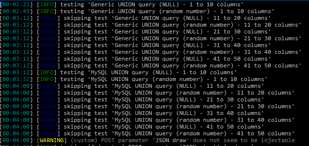
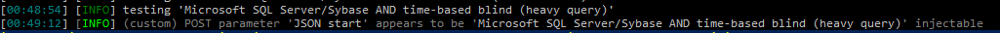
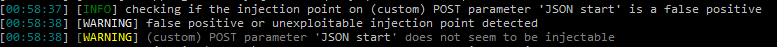
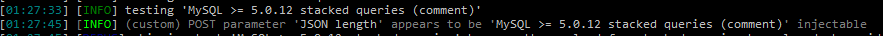
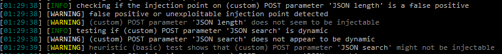
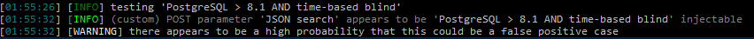
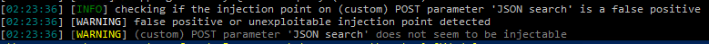

# Laporan Pengujian SQL Injection Endpoint Buku

## Informasi Endpoint
- **Endpoint:** `/type-r-v2/api/Buku`
- **Method:** POST
- **Body/JSON Original:**
    ```json
    {
        "draw": "1",
        "start": "0",
        "length": "10",
        "search": "katalog"
    }
    ```

## Ringkasan Pengujian
Pengujian ini dilakukan untuk mengidentifikasi potensi kerentanan SQL Injection pada endpoint `/type-r-v2/api/Buku` dengan metode POST. Semua parameter diuji untuk kemungkinan eksploitasi SQL Injection.

## Detail Temuan
Tidak ditemukan kerentanan SQL Injection pada endpoint yang diuji. Semua parameter yang diuji menunjukkan hasil false positif.

## Metodologi Pengujian
1. **Identifikasi Endpoint:** Mengidentifikasi endpoint yang akan diuji.
2. **Penyusunan Payload:** Menyusun payload yang mengandung karakteristik SQL Injection.
3. **Pengujian Parameter:** Mengirimkan payload ke setiap parameter dalam body JSON.
4. **Analisis Respon:** Menganalisis respon dari server untuk mendeteksi adanya indikasi SQL Injection.

## Hasil Pengujian
- **Parameter `draw`:** False positif
    
- **Parameter `start`:** False positif
    
    
- **Parameter `length`:** False positif
    
    
- **Parameter `search`:** False positif
    
    

## Kesimpulan
Tidak ditemukan kerentanan SQL Injection pada endpoint `/type-r-v2/api/Buku`. Semua parameter yang diuji menunjukkan hasil false positif.

## Rekomendasi
- Tetap lakukan pemantauan dan pengujian berkala untuk memastikan keamanan aplikasi.
- Implementasikan validasi input yang ketat pada semua parameter.

## Rekomendasi Tambahan
- Gunakan prepared statements atau parameterized queries untuk menghindari SQL Injection.
- Terapkan mekanisme logging dan monitoring untuk mendeteksi aktivitas mencurigakan.

## Kesimpulan Akhir
Endpoint `/type-r-v2/api/Buku` aman dari serangan SQL Injection berdasarkan pengujian yang telah dilakukan. Namun, tetap disarankan untuk menerapkan praktik keamanan terbaik secara konsisten.

**CWE Terkait:** [CWE-89: Improper Neutralization of Special Elements used in an SQL Command ('SQL Injection')](https://cwe.mitre.org/data/definitions/89.html)


## Skor CVSS 3.1 untuk SQL Injection
- **Base Score:** 9.8 (Critical)
- **Vector:** `AV:N/AC:L/PR:N/UI:N/S:U/C:H/I:H/A:H`
- **Exploitability Score:** 3.9
- **Impact Score:** 5.9
