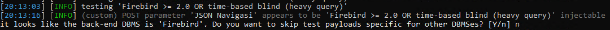

# Laporan Pengujian SQL Injection Endpoint CashIn

## Informasi Endpoint
- **Endpoint**: `/type-r-v2/api/CashIn`
- **Metode**: POST
- **Body**:
    ```json
    {
        "Navigasi": "topup",
        "Jasa": "payment_service",
        "Ip": "192.168.1.100",
        "DeviceId": "A1B2C3D4E5",
        "Latitude": "-6.200000",
        "Longitude": "106.816666",
        "Harga": 50000,
        "Nominal": 100000,
        "Pin": "123456",
        "crbayar": 1,
        "Nomor": "08123456789",
        "UsePoin": "no"
    }
    ```

## Ringkasan Pengujian
Pengujian dilakukan untuk mengidentifikasi potensi kerentanan SQL Injection pada endpoint `/type-r-v2/api/CashIn`. Beberapa parameter diuji untuk menentukan apakah mereka rentan terhadap serangan SQL Injection.

## Detail Temuan
### Parameter yang Diuji
- `Navigasi`
- `Jasa`
- `Ip`
- `DeviceId`
- `Latitude`
- `Longitude`
- `Harga`

### Hasil Pengujian
- **Navigasi**: False positif

    

    

    

- **Jasa**: False positif

    

    

- **Ip**: False positif

    

    

- **DeviceId**: False positif

    

    

- **Latitude**: False positif

    

    

    

- **Longitude**: False positif

    

    

    

- **Harga**: Connection Error

## Metodologi Pengujian
Pengujian dilakukan dengan mengirimkan berbagai payload yang dirancang untuk mengidentifikasi kerentanan SQL Injection. Setiap parameter diuji untuk melihat apakah mereka dinamis dan rentan terhadap serangan SQL Injection.

## Hasil Pengujian
Tidak ditemukan kerentanan SQL Injection pada parameter yang diuji. Semua parameter yang diuji tidak menunjukkan tanda-tanda injeksi SQL yang dapat dieksploitasi.

## Kesimpulan
Berdasarkan hasil pengujian, tidak ditemukan kerentanan SQL Injection pada endpoint `/type-r-v2/api/CashIn`. Semua parameter yang diuji tidak rentan terhadap serangan SQL Injection.

## Rekomendasi
- Tetap lakukan pemantauan dan pengujian berkala untuk memastikan keamanan aplikasi.
- Terapkan validasi input yang ketat pada semua parameter yang diterima oleh server.
- Gunakan prepared statements atau parameterized queries untuk menghindari SQL Injection.

## Rekomendasi Tambahan
- Lakukan pelatihan keamanan bagi tim pengembang untuk meningkatkan kesadaran tentang kerentanan keamanan.
- Implementasikan mekanisme deteksi dan pencegahan intrusi (IDS/IPS) untuk mendeteksi serangan yang mencurigakan.

## Kesimpulan Akhir
Pengujian ini menunjukkan bahwa endpoint `/type-r-v2/api/CashIn` aman dari serangan SQL Injection berdasarkan parameter yang diuji. Namun, tetap disarankan untuk melakukan pengujian keamanan secara berkala dan menerapkan praktik terbaik dalam pengembangan aplikasi.

### Referensi CWE
- **CWE-89**: SQL Injection
- **CVSS 3.1 Score**: 9.8 (Critical)


