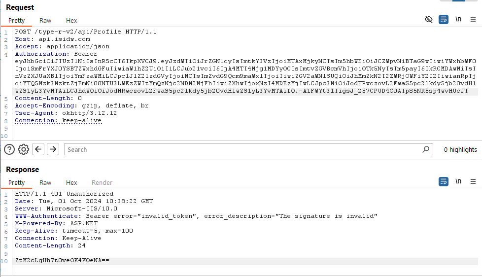

# Laporan Pengujian _Broken Authentication_ Endpoint Profile

Pengujian ini berfokus pada manipulasi token autentikasi (Bearer Token) untuk mencoba mengakses data pengguna yang berbeda atau melakukan modifikasi parameter dalam token.

## **Informasi Endpoint**
   - **URL:** `POST /type-r-v2/api/Profile`
   - **Host:** `api.isidw.com`
   - **Method:** `POST`
   - **Header Utama:**  
     - `Authorization: Bearer [TOKEN]`
     - `Content-Type: application/json`
     - `User-Agent: okhttp/3.12.12`
   - **Request:** Data dikirim tanpa body (Content-Length: 0).
   
## **Ringkasan Pengujian**
   Pengujian dilakukan untuk mengeksplorasi potensi kerentanan pada sistem autentikasi melalui modifikasi Bearer Token yang digunakan dalam request. Pengujian berfokus pada manipulasi data dalam payload JWT untuk mencoba memalsukan identitas pengguna, termasuk mengganti ID pengguna dan nomor telepon.

## **Detail Temuan**
   - **Token Payload Asli:**
     ```json
     {
       "sub": "kdcus",
       "kdcus": "10xxx",
       "nama": "user xxx",
       "alamat": "Address 1",
       "image": "",
       "nomor": "08xxx28",
       "kodeArea": "9997",
       "nik": "DBxxx",
       "userTipe": "basic",
       "isRegister": "0",
       "fotoProfile": "",
       "deviceID": "a2fd7b6edc9abcb6",
       "jti": "a4939739-f1f6-4557-a3eb-bd367643621a",
       "exp": 1728013220,
       "iss": "https://api.isidw.com/type-r/v/10",
       "aud": "https://api.isidw.com/type-r/v/10"
     }
     ```

     _Beberapa data telah diubah untuk keperluan dokumentasi._

     **Temuan Utama:**
     - Modifikasi `kdcus` menghasilkan respon **401 Unauthorized**, menandakan verifikasi token berhasil mendeteksi perubahan dan mencegah akses tidak sah.
       
     - Modifikasi `nomor` (nomor telepon yang digunakan untuk login) menghasilkan respon **401 Unauthorized**.
       
     - Modifikasi `userTipe` dari `basic` ke `premium` menghasilkan respon **401 Unauthorized**.
       
     - Modifikasi `isRegister` dari `0` ke `1` menghasilkan respon **401 Unauthorized**.
       
     - Ketika modifikasi dilakukan pada `image` dan `exp` (data non-sensitive), hasilnya tetap **401 Unauthorized** dengan output yang sama.

## **Metodologi Pengujian**
   Pengujian dilakukan dengan pendekatan manual untuk mengevaluasi respon sistem terhadap modifikasi JWT. Metode yang digunakan melibatkan:
   - **Modifikasi Payload JWT:** Mengganti beberapa parameter penting seperti `kdcus`, `nomor`, `userTipe`, `isRegister`, `exp`, dan `image` untuk mengevaluasi sistem autentikasi.
   - **Pengiriman Request Modifikasi:** Menggunakan metode POST dengan header Bearer Token yang telah diubah dan memperhatikan respon server untuk mengetahui apakah ada kelemahan dalam validasi token.

## **Hasil Pengujian**
   - **Pengujian 1:** Modifikasi `kdcus` menghasilkan respon **401 Unauthorized**.
   - **Pengujian 2:** Modifikasi `nomor` juga menghasilkan respon **401 Unauthorized**.
   - **Pengujian 3:** Modifikasi `userTipe` dari `basic` ke `premium` menghasilkan respon **401 Unauthorized**.
   - **Pengujian 4:** Modifikasi `isRegister` dari `0` ke `1` menghasilkan respon **401 Unauthorized**.
   - **Pengujian 5:** Modifikasi `image` dan `exp` tidak menghasilkan akses yang valid.

   Setiap pengujian menghasilkan respon yang sama dengan detail:
   ```
   HTTP/1.1 401 Unauthorized
   WWW-Authenticate: Bearer error="invalid_token", error_description="The signature is invalid"
   ZtM2cLgHh7t0veOK4KOeNA==
   ```

## **Kesimpulan**
   Berdasarkan hasil pengujian, sistem validasi Bearer Token pada endpoint ini telah bekerja dengan baik dalam memverifikasi integritas token. Modifikasi pada payload token menghasilkan respon **401 Unauthorized** dan tidak ada informasi sensitif yang terekspos. 

   Berdasarkan hasil pengujian, sistem validasi Bearer Token pada endpoint `/type-r-v2/api/Profile` dengan memodifikasi beberapa parameter penting dan bahkan data non-sensitive, dapat disimpulkan untuk end-point lainpun validasi token berjalan dengan baik dan tidak rentan terhadap serangan _Broken Authentication_.

## **Rekomendasi**
   - **Rotasi Token Secara Berkala:** Implementasikan mekanisme rotasi token secara berkala untuk memperkecil kemungkinan token reuse oleh pihak tidak sah.
   - **Logging dan Monitoring:** Lakukan monitoring pada aktivitas yang mencurigakan, terutama percobaan akses yang tidak sah dengan token yang tidak valid.

## **Rekomendasi Tambahan**
   - **Penanganan Token Expired yang Lebih Baik:** Pastikan sistem menangani token yang sudah kadaluarsa (expired) dengan respon yang jelas, seperti mengarahkan pengguna untuk login ulang atau memperbarui token.
   - **Penerapan Multi-Factor Authentication (MFA):** Pertimbangkan untuk menambahkan MFA sebagai lapisan keamanan tambahan untuk melindungi akun pengguna dari potensi peretasan melalui manipulasi token.

## **Kesimpulan Akhir**
   Pengujian ini menunjukkan bahwa mekanisme validasi Bearer Token pada endpoint `/type-r-v2/api/Profile` telah berfungsi dengan baik dan aman dari serangan manipulasi token yang diujikan. Dengan penambahan langkah-langkah keamanan seperti MFA dan monitoring yang lebih baik, keamanan sistem dapat lebih ditingkatkan.

---

**Referensi CWE**  
- **CWE-287: Improper Authentication**
   - _Score CVSS 3.1_: 7.5 (High)